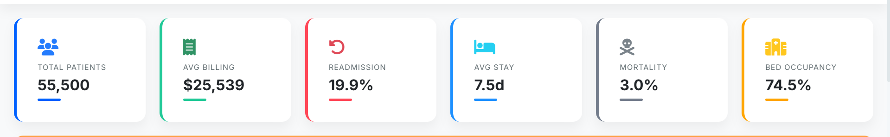
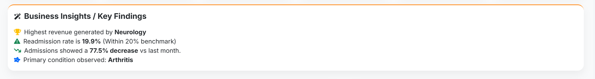

# ❤️ Healthcare Analytics Dashboard


---

## 🚀 Overview

A **production-ready Healthcare Analytics Dashboard** built using **Python, Dash (Plotly), and Pandas** to analyze patient data, financial metrics, and operational trends.

This dashboard simulates a **real-world hospital analytics platform**, providing:

* 📊 Interactive KPIs
* 📈 Advanced visualizations
* 🔍 Dynamic filtering
* 🤖 AI-style business insights

Designed to replicate tools like **Power BI / Tableau dashboards** used in enterprise environments.

---

## 🌟 Key Features

### 📊 KPI Metrics

* Total Patients
* Average Billing Amount
* Readmission Rate
* Average Length of Stay
* Mortality Rate
* Bed Occupancy

---

### 📈 Interactive Visualizations

* Age distribution by gender
* Medical condition analysis (donut chart)
* Insurance provider comparison
* Billing distribution histogram
* Admission trends over time
* Department-level analysis

---

### 🔍 Advanced Analytics

* 🔄 Cross-filtering (Power BI–style interactions)
* 📅 Global date range filtering
* 📊 Funnel analysis (patient flow)
* 💧 Waterfall chart (billing breakdown)

---

### 🤖 AI-Style Insights

* Dynamically generated business insights such as:

  * Highest revenue department
  * Readmission trends
  * Cost anomalies
  * Operational recommendations

---

### 📂 Data Handling

* Upload custom CSV datasets
* Automatic column detection
* Handles missing data dynamically
* Real-time dashboard updates

---

### 📤 Export Features

* Download filtered data as CSV
* Ready for business reporting

---

### 🎨 UI/UX Enhancements

* Modern card-based layout
* Responsive design (desktop + mobile)
* Smooth animations
* Clean typography & spacing
* Dark mode ready (optional enhancement)

---

## 🧠 Business Impact

This dashboard enables:

* 📉 Reduction in readmission rates through trend monitoring
* 💰 Identification of high-revenue departments
* ⚡ Faster decision-making using real-time insights
* 🏥 Optimization of hospital resource utilization

---

## 📂 Project Structure

```text
├── app.py                  # Main Dash application
├── assets/
│   ├── healthcare.csv      # Sample dataset
│   ├── style.css           # Custom styling
├── screenshots/            # Dashboard preview images
```

---

## 🚀 Installation & Setup

```bash
# Clone repository
git clone https://github.com/your-username/Healthcare-Analytics-Dashboard.git

# Navigate to project
cd Healthcare-Analytics-Dashboard

# Install dependencies
pip install -r requirements.txt

# Run the application
python app.py
```

➡️ App runs on: **http://127.0.0.1:8050**

---

## 📊 Dataset

The sample dataset includes:

* 👤 Patient demographics (Age, Gender)
* 🏥 Medical data (Condition, Admission Date)
* 💰 Financials (Billing Amount, Insurance Provider)
* 📈 Operational metrics (Readmission, Length of Stay)

You can upload your own dataset with similar columns.

---

## 🛠️ Tech Stack

* **Advanced Dynamic Insights** – Automated business logic analysis using Pandas.
* **Power BI Style Interactivity** – Cross-filtering and drill-down across all charts.
* **Global Date Range Filter** – Temporal analysis across the entire dataset.
* **Dual Theme Engine** – Seamless Light and Dark mode toggle.
* **Enterprise Data Export** – Download filtered datasets directly to CSV.
* **Robust Data Handling** – `dcc.Store` for persistence and dynamic CSV autodetect.
* **Dash Bootstrap Components** – Modern SaaS-style UI layout.
* **Custom CSS** – Premium aesthetics with glassmorphism and soft shadows.

---

## 📷 Dashboard Gallery

### 1. Enterprise Dashboard Overview


### 2. Strategic KPI Monitoring


### 3. Dynamic Business Insights


### 4. Patient Demographics & Gender Analysis


### 5. Financial & Insurance Comparison


### 6. Admission Trends & Patient Flow


### 7. Department Analysis & Cost Breakdown


