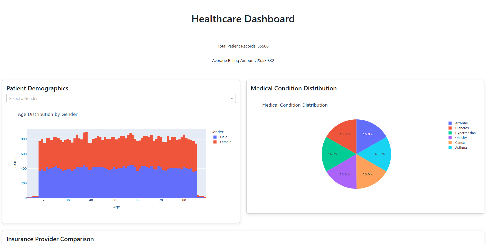
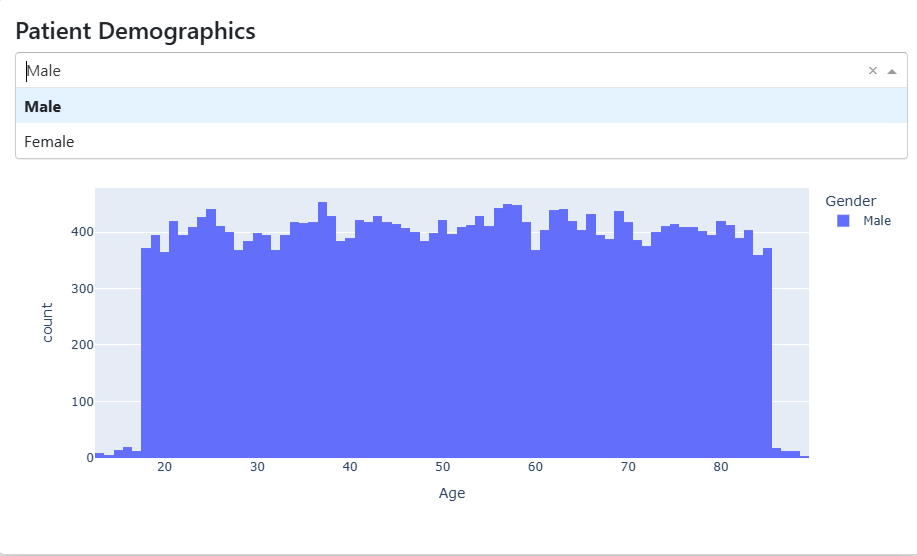
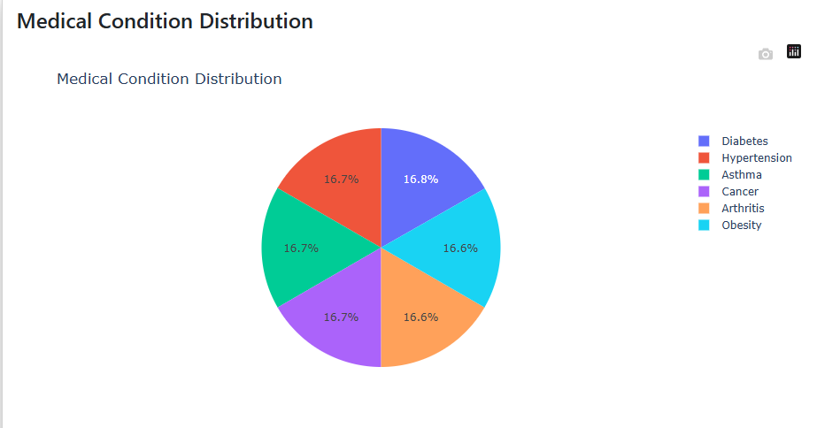
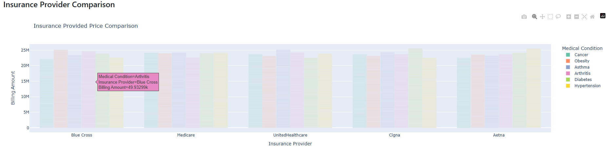
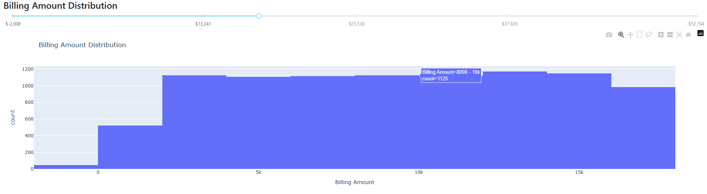
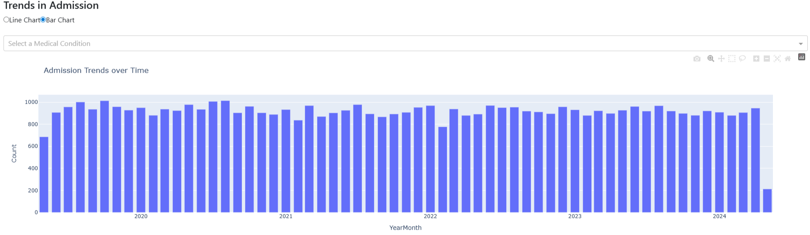
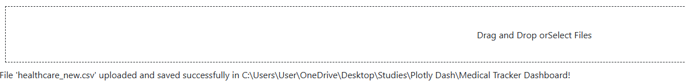

# ❤️ Healthcare Analytics Dashboard


An interactive dashboard built with **Dash (Plotly)**, **Pandas**, and **Bootstrap** for visualizing healthcare data.  
This tool helps track patient demographics, medical conditions, billing amounts, insurance comparisons, and admission trends.  
It also supports uploading custom healthcare datasets for dynamic analysis.

<br>

## 🌟 Features

- **Patient Overview**  
  Displays total patient records and average billing amount.

- **Demographics Analysis**  
  Interactive age distribution charts filtered by gender.

- **Medical Condition Insights**  
  Pie charts showing the distribution of patient conditions.

- **Insurance Provider Comparison**  
  Compare billing amounts across insurance providers with grouped bar charts.

- **Billing Amount Distribution**  
  Histogram with a slider to explore billing ranges.

- **Admission Trends**  
  Line/Bar charts of patient admissions over time, with condition filtering.

- **Custom Data Upload**  
  Upload your own CSV healthcare dataset and explore instantly.

<br>

## 📂 Architeture
```text
├── app.py # Main Dash application
├── assets/
│ ├── healthcare.csv # Sample dataset
│ ├── style.css # Custom styling
├── screenshots/ # Screenshots
```
<br>

## 🚀 Installation


```bash
# Clone repository
git clone https://github.com/your-username/Healthcare-Analytics-Dashboard.git 
  
# Install dependencies
pip install -r requirements.txt

# Run application
python app.py

The app will start on http://127.0.0.1:8050.
```
<br>
    
## 📊 Dataset

The sample dataset (healthcare.csv) includes:

- Patient demographics (Age, Gender)

- Medical details (Condition, Date of Admission)

- Billing information (Billing Amount, Insurance Provider)

You can replace or upload your own CSV file with similar columns.

<br>

## 🎨 Styling
Custom styles are defined in assets/style.css, including:

- Card hover effects

- Enhanced shadows and spacing

- Radio button styling

<br>

## 💻 Tech Stack
- **Python** – core programming language  
- **Dash (Plotly)** – interactive web framework for building dashboards  
- **Dash Bootstrap Components** – Bootstrap styling & responsive layout  
- **Pandas** – data manipulation and analysis  
- **Plotly** – data visualization (charts, graphs)  
- **CSS** – custom design enhancements  

<br>
  
## 📷 Screenshots

1. Dashboard Overview


2. Patient Demographics


3. Medical Condition Distribution


4. Insurance Provider Comparison


5. Billing Amount Distribution


6. Admission Trends


7. File Upload Feature


<br>


